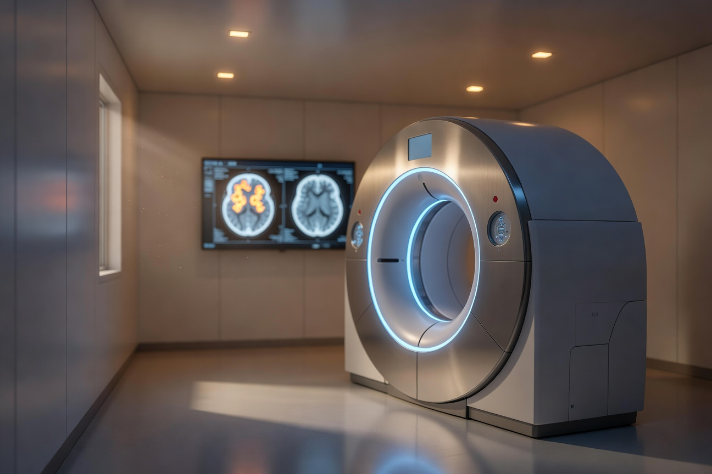

# Deep Learning for 3D Medical Imaging



A pedagogical tutorial series for ML engineers with no medical physics background. Covers the full pipeline from raw DICOM/NIfTI data handling to state-of-the-art reconstruction with OSEM, conditional GANs, and diffusion models.

## Notebooks

| # | Notebook | Topics |
|---|----------|--------|
| 1 | [3D Data Loading & Manipulation](notebooks/01_3d_data_loading.ipynb) | PET/SPECT/CT physics primer, PyDICOM, NiBabel, coordinate systems (LPS/RAS), affine matrices, 3D visualization |
| 2 | [Reconstruction & Metrics](notebooks/02_reconstruction_metrics.ipynb) | Radon transform, FBP, MLEM, OSEM from scratch, attenuation correction, medical metrics (Dice, SUV, TPD), statistical validation (C-statistic, NRI, IDI, Brier) |
| 3a | [OSEM with PyTomography](notebooks/03a_osem_reconstruction.ipynb) | PyTomography API, system matrices, OSEM with corrections (attenuation, scatter, PSF), noise-resolution trade-offs |
| 3b | [Conditional GAN for SPECT AC](notebooks/03b_conditional_gan.ipynb) | DeepAC, 3D U-Net generator, PatchGAN discriminator, adversarial + L1 training, clinical evaluation |
| 3c | [Diffusion-Based PET Reconstruction](notebooks/03c_diffusion_reconstruction.ipynb) | DDPM fundamentals, measurement-conditioned generation, posterior guidance, OSEM vs GAN vs Diffusion comparison |

## Setup

```bash
# Clone
git clone https://github.com/XingfuY/Deep_Learning_Medical_Image.git
cd Deep_Learning_Medical_Image

# Create environment
python -m venv .venv
source .venv/bin/activate
pip install -r requirements.txt

# Launch notebooks
jupyter notebook notebooks/
```

## Data

See [`data/README.md`](data/README.md) for download instructions. Notebooks include synthetic data generators as fallbacks, so you can run everything without downloading clinical datasets.

## Companion Blog Posts

This project has companion blog posts at [xyang.me](https://xyang.me/projects/deep-learning-medical-image) covering the theory in depth:

1. [The DL Engineer's Field Guide to 3D Medical Imaging](https://xyang.me/posts/dl-medical-imaging-intro) — PET/SPECT physics, DICOM, NIfTI, coordinate systems
2. [Reconstructing Reality: OSEM and the Math of PET Imaging](https://xyang.me/posts/osem-reconstruction) — Inverse problems, MLEM, OSEM, attenuation correction
3. [GANs in the Hospital: Conditional Adversarial Networks for SPECT](https://xyang.me/posts/conditional-gan-medical) — DeepAC, training pipelines, clinical validation
4. [Diffusion Models Meet Medical Reconstruction](https://xyang.me/posts/diffusion-medical-recon) — DDPM for inverse problems, posterior guidance
5. [Medical AI Validation: Beyond AUC](https://xyang.me/posts/medical-ai-validation) — C-statistic, NRI, IDI, calibration, reclassification

## License

MIT
